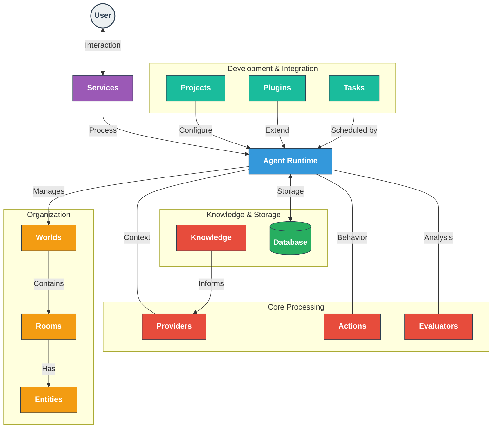
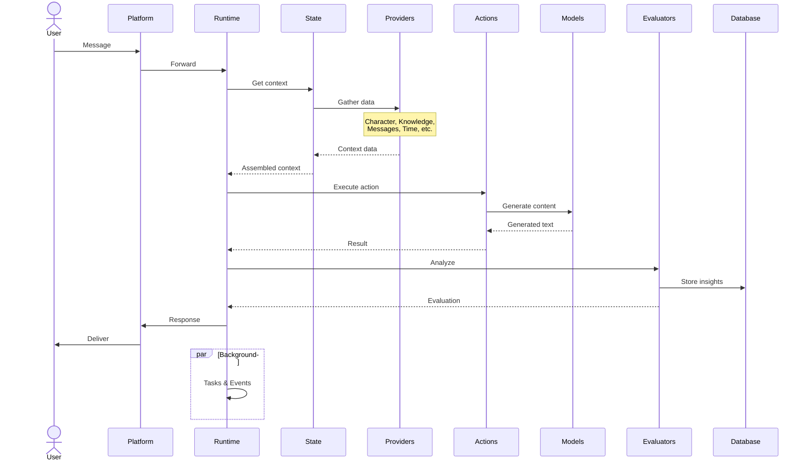

Eliza Docs 1 Intro Quickstart Overview Runtime Projects


# Introduction to Eliza


## What is Eliza?

Eliza is a powerful multi-agent simulation framework designed to create, deploy, and manage autonomous AI agents. Built with TypeScript, it provides a flexible and extensible platform for developing intelligent agents that can interact across multiple platforms while maintaining consistent personalities and knowledge.


## Key Features

- **Platform Integration**: Clients for Discord, X (Twitter), Telegram, and many others
- **Flexible Model Support**: Deepseek, Ollama, Grok, OpenAI, Anthropic, Gemini, LLama, etc.
- **Character System**: Create diverse agents using [character files](https://github.com/elizaOS/characterfile)
- **Multi-Agent Architecture**: Manage multiple unique AI personalities simultaneously
- **Memory Management**: Easily ingest and interact with documents using RAG
- **Media Processing**: PDF, URLs, Audio transcription, Video processing, Image analysis, Conversation summarization
- **Technical Foundation**:
  - 100% TypeScript implementation
  - Modular architecture
  - Highly extensible action and plugin system
  - Custom client support
  - Comprehensive API

## Use Cases

Eliza can be used to create:

- **AI Assistants**: Customer support agents, Community moderators, Personal assistants
- **Social Media Personas**: Automated content creators, Brand representatives, Influencers
- **Knowledge Workers**: Research assistants, Content analysts, Document processors
- **Interactive Characters**: Role-playing characters, Educational tutors, Entertainment bots

---

## Getting Started


### Prerequisites

- [Node.js 23+](https://docs.npmjs.com/downloading-and-installing-node-js-and-npm)
- Git for version control
- For Windows Users: [WSL 2](https://learn.microsoft.com/en-us/windows/wsl/install-manual) is required

### Multiple Paths to Start

Eliza offers different paths depending on your goals:

#### 1. Simple Start - Run Quickly

```bash
# Install globally (optional but recommended)
npm install -g @elizaos/cli

# Start with default settings
npx elizaos start
```

Visit https://localhost:3000 to interact with your agent through a web interface.

#### 2. Create Your Own Project

```bash
# Create a new project through interactive setup
npx elizaos create

# Navigate to your project directory
cd my-project-name

# Start your project
npx elizaos start
```

Add plugins to your project:

```bash
# List available plugins
npx elizaos project list-plugins

# Add a plugin
npx elizaos project add-plugin @elizaos/plugin-discord
```

#### 3. Develop a Custom Plugin

```bash
# Create a plugin project
npx elizaos create --type plugin

# Follow the interactive prompts
```

Develop and test your plugin:

```bash
# Test your plugin
npx elizaos start

# Publish your plugin when ready
npx elizaos plugin publish
```

#### 4. Contribute to ElizaOS Core

```bash
# Clone the repository
git clone git@github.com:elizaOS/eliza.git
cd eliza

# Install dependencies and build
bun install
bun run build

# Start ElizaOS
bun start
```

Visit https://localhost:3000 to interact with your agent through a web interface.


---

## Community and Support

Eliza is backed by an active community of developers and users.

- [**Open Source**](https://github.com/elizaos/eliza): Contribute to the project on GitHub


# Quickstart Guide

---

## 1. Simple Start - Get Running Quickly

The fastest way to get started with ElizaOS is using the CLI:

```bash
# Install globally (optional but recommended)
npm install -g @elizaos/cli

# Or use directly with npx
npx elizaos start
```

This will:

1. Start ElizaOS with default settings
2. Load the default character
3. Make the agent accessible via terminal and REST API

### Chat with your agent:

Visit https://localhost:3000 to interact with your agent through a web interface.

## 2. Creating a Project

If you want to create a custom ElizaOS project with your own characters and configurations:

```bash
# Create a new project with the interactive wizard
npx elizaos create

# Or specify project type directly
npx elizaos create --type project
```

Follow the interactive prompts to configure your project. Once created:

```bash
# Navigate to your project directory
cd my-project-name

# Start your project
npx elizaos start
```

### Add plugins to your project:

```bash
# List available plugins
npx elizaos project list-plugins

# Add a plugin
npx elizaos project add-plugin @elizaos-plugins/client-discord
```

## 3. Creating a Plugin

Want to extend ElizaOS with custom functionality?

```bash
# Create a new plugin project
npx elizaos create --type plugin

# Follow the interactive prompts
```

Develop your plugin following the structure in your generated project:

```bash
# Test your plugin
npx elizaos start

# Publish your plugin when ready
npx elizaos plugin publish
```

### Publishing options:

```bash
# Test publish without making changes
npx elizaos plugin publish --test

# Publish to npm
npx elizaos plugin publish --npm

# Specify platform compatibility
npx elizaos plugin publish --platform node
```

## 4. Contributing to ElizaOS

If you want to add features or fix bugs in the ElizaOS core:

```bash
# Clone the repository
git clone git@github.com:elizaOS/eliza.git
cd eliza

# Switch to development branch
git checkout develop

# Install dependencies
bun install

# Build the project
bun build

# Start ElizaOS
bun start
```

Visit https://localhost:3000 to interact with your agent through a web interface.

### Automated setup:

```bash
git clone git@github.com:elizaOS/eliza.git
cd eliza

# Run the start script with verbose logging
./scripts/start.sh -v
```

---

## Troubleshooting

### Common Issues

#### Node Version

- Use Node.js 23.3.0+ (`node -v` to check)
- Try using NVM: `nvm use 23`

#### Installation Problems

```bash
# Clean and reinstall
bun clean
bun install --no-frozen-lockfile
bun build
```

#### Plugin Issues

```bash
# Rebuild problematic packages
bun rebuild better-sqlite3
```

#### Docker Issues

```bash
# Clean up Docker environment
docker rmi -f $(docker images -aq)
docker builder prune -a -f
```
---

# ElizaOS Documentation

Welcome to ElizaOS - a comprehensive framework for building AI agents with persistent personalities across multiple platforms. ElizaOS provides the architecture, tools, and systems needed to create sophisticated agents that maintain consistent behavior, learn from interactions, and seamlessly integrate with a variety of services.

## System Architecture

ElizaOS uses a modular architecture that separates concerns while providing a cohesive framework for AI agent development:



### How ElizaOS Works

When a user message is received:

1. **Service Reception**: Platform service (Discord, Telegram, etc.) receives the message
2. **Runtime Processing**: Agent runtime coordinates the response generation
3. **Context Building**: Providers supply relevant context (time, recent messages, knowledge)
4. **Action Selection**: The agent evaluates and selects appropriate actions
5. **Response Generation**: The chosen action generates a response
6. **Learning & Reflection**: Evaluators analyze the conversation for insights and learning
7. **Memory Storage**: New information is stored in the database
8. **Response Delivery**: The response is sent back through the service

This creates a continuous cycle of interaction, reflection, and improvement that allows agents to maintain consistent personalities while adapting to new information.

## Core Components

Agent Runtime
Services
Database

 Agent Runtime
          The central system that orchestrates agent behavior, processes messages, manages state, and coordinates all other components.
          

Services
          Platform-specific integrations that enable agents to communicate across Discord, Twitter, Telegram, and other channels.
    

Database
          Persistent storage for memories, entity data, relationships, and configuration using vector search capabilities.


## Intelligence & Behavior

Actions
Executable capabilities that define how agents respond to messages and interact with external systems.
       
    
Providers
Data sources that supply contextual information to inform agent decision-making in real-time.
    

Evaluators
          Analytical systems that process conversations to extract insights, learn facts, and improve future responses.
 
Knowledge
          RAG system for document processing, semantic search, and context-aware memory retrieval.
      
## Structure & Organization

Worlds
          Collection spaces that organize entities and rooms into coherent environments (like a Discord server).
       
   
          Rooms
          Conversation spaces where entities interact through messages (channels, DMs, threads).
        
    
Entities
          Representation of users, agents, and other participants using a flexible entity-component architecture.

## Development & Integration

Plugins
          Modular extensions that add new capabilities, integrations, and behaviors to agents.
    
    
Projects
          Organizational structure for defining and deploying one or more agents with their configuration.
        
Tasks
          System for managing deferred, scheduled, and repeating operations across conversations.
        
---

## Key Concepts

### Action-Provider-Evaluator Cycle

The core of the ElizaOS system operates as a continuous cycle:

1. **Providers** gather context before response generation
2. **Actions** determine what the agent can do and are executed to generate responses
3. **Evaluators** analyze conversations after responses to extract insights
4. These insights become part of the agent's memory
5. Future **Providers** access this memory to inform new responses

This creates a virtuous cycle where agents continuously learn and improve from interactions.

### Entity-Component Architecture

ElizaOS uses an entity-component architecture for flexible data modeling:

- **Entities** are base objects with unique IDs (users, agents, etc.)
- **Components** are pieces of data attached to entities (profiles, settings, etc.)
- This approach allows for dynamic composition without complex inheritance hierarchies

### Memory System

The memory system in ElizaOS provides:

- **Vector-based semantic search** for finding relevant memories
- **Multi-level memory types** (messages, facts, knowledge)
- **Temporal awareness** through timestamped memories
- **Cross-platform continuity** while maintaining appropriate context boundaries

## Getting Started

If you're new to ElizaOS, we recommend this learning path:

1. Start with this overview to understand the system architecture
2. Explore the Agent Runtime to understand the core system
3. Learn about Projects to set up your development environment
4. Learn how Actions and Providers work together.
5. Explore Services to connect with external platforms
6. Dive into Plugins to extend functionality

## FAQ

### What's the difference between Actions, Evaluators, and Providers?

**Actions** define what an agent can do and are executed during response generation. **Evaluators** analyze conversations after they happen to extract insights and improve future responses. **Providers** supply contextual information before the agent decides how to respond.

### How does ElizaOS handle cross-platform conversation context?

ElizaOS maintains separate conversation contexts for different platforms by default, but shares entity relationships and learned facts across platforms. This ensures agents maintain a consistent understanding of users while respecting platform-specific conversation boundaries.

### How does the memory system work?

Memory is organized into different types (messages, facts, knowledge) and stored with vector embeddings for semantic search. This allows agents to retrieve relevant memories based on context rather than just recency, creating more natural conversations.

### What's the relationship between Worlds, Rooms, and Entities?

Worlds are container spaces (like a Discord server) that can have multiple Rooms (channels, DMs). Entities (users, agents) participate in Rooms within Worlds. This hierarchical structure mirrors real-world platforms while providing a consistent abstraction.

### How extensible is ElizaOS?

ElizaOS is highly extensible through its plugin system. You can create custom actions, providers, evaluators, services, and more to extend functionality. The architecture is designed to be modular and composable at every level.


# Agent Runtime

The `AgentRuntime` is the core runtime environment for Eliza agents. It handles message processing, state management, plugin integration, and interaction with external services. You can think of it as the brains that provide the high-level orchestration layer for Eliza agents.



The runtime follows this general flow:

1. **Initial Reception**: The user sends a message which is received by the Platform Services
2. **Context Building**:

   - The Runtime Core requests context from the State Composition system
   - State gathers data from various Providers (Character, Knowledge, Recent Messages, etc.)
   - The complete context is returned to the Runtime

3. **Action Processing**:

   - The Runtime determines applicable actions and selects the optimal one
   - The selected action may request content generation from Models
   - The action result is returned to the Runtime

4. **Learning & Persistence**:

   - The conversation is analyzed by Evaluators for insights and facts
   - Knowledge updates are sent to the Memory System
   - All relevant data is persisted to the Database

5. **Response Delivery**:
   - The final response is sent back to the user through Platform Services

---

## Overview

The [AgentRuntime](/api/classes/AgentRuntime) class is the primary implementation of the [IAgentRuntime](/api/interfaces/IAgentRuntime) interface, which manages the agent's core functions, including:

| Component             | Description                                                                                                                                                                             | API Reference                                                    | Related Files                                                                                                                                                                                                                                                                                                                                                                                                                                                                                                                                                                                                  |
| --------------------- | --------------------------------------------------------------------------------------------------------------------------------------------------------------------------------------- | ---------------------------------------------------------------- | -------------------------------------------------------------------------------------------------------------------------------------------------------------------------------------------------------------------------------------------------------------------------------------------------------------------------------------------------------------------------------------------------------------------------------------------------------------------------------------------------------------------------------------------------------------------------------------------------------------- |
| **Services**          | Supports multiple communication platforms and specialized functionalities for seamless interaction.                                                                                     | [Services API](/api/interfaces/IAgentRuntime/#services)          | [`service.ts`](https://github.com/elizaOS/eliza/tree/develop/packages/core/src/service.ts), [`Discord`](https://github.com/elizaos-plugins/plugin-discord), [`Telegram`](https://github.com/elizaos-plugins/plugin-telegram), [`Twitter`](https://github.com/elizaos-plugins/plugin-twitter), [`Farcaster`](https://github.com/elizaos-plugins/plugin-farcaster), [`Lens`](https://github.com/elizaos-plugins/plugin-lens), [`Slack`](https://github.com/elizaos-plugins/plugin-slack), [`Auto`](https://github.com/elizaos-plugins/plugin-auto), [`GitHub`](https://github.com/elizaos-plugins/plugin-github) |
| **State**             | Maintains context for coherent cross-platform interactions, updates dynamically. Also tracks goals, knowledge, and recent interactions                                                  | [State API](/api/interfaces/State)                               | [`state.ts`](https://github.com/elizaos/runtime/state.ts)                                                                                                                                                                                                       |
| **Plugins**           | Dynamic extensions of agent functionalities using custom actions, evaluators, providers, and adapters                                                                                   | [Plugins API](/api/type-aliases/Plugin/)                         | [`plugins.ts`](https://github.com/elizaos/runtime/plugins.ts), [actions](../actions), [evaluators](../evaluators), [providers](../providers)                                                                                                                                                                                                                                                                                                                                                                                                                                                                   |
| **Services**          | Connects with external services for `IMAGE_DESCRIPTION`, `TRANSCRIPTION`, `TEXT_GENERATION`, `SPEECH_GENERATION`, `VIDEO`, `PDF`, `BROWSER`, `WEB_SEARCH`, `EMAIL_AUTOMATION`, and more | [Services API](/api/interfaces/IAgentRuntime/#services)          | [`services.ts`](https://github.com/elizaos/runtime/services.ts)                                                                                                                                                                                                                                                                                                                                                                                                                                                                                                                                                |
| **Memory Systems**    | Creates, retrieves, and embeds memories and manages conversation history.                                                                                                               | [Memory API](/api/interfaces/IMemoryManager)                     | [`memory.ts`](https://github.com/elizaos/runtime/memory.ts)                                                                                                                                                                                                                                                                                                                                                                                                                                                                                                                                                    |
| **Database Adapters** | Persistent storage and retrieval for memories and knowledge                                                                                                                             | [databaseAdapter](api/interfaces/IAgentRuntime/#databaseAdapter) | [`MongoDB`](https://github.com/elizaos-plugins/adapter-mongodb), [`PostgreSQL`](https://github.com/elizaos-plugins/adapter-postgres), [`SQLite`](https://github.com/elizaos-plugins/adapter-sqlite), [`Supabase`](https://github.com/elizaos-plugins/adapter-supabase), [`PGLite`](https://github.com/elizaos-plugins/adapter-pglite), [`Qdrant`](https://github.com/elizaos-plugins/adapter-qdrant), [`SQL.js`](https://github.com/elizaos-plugins/adapter-sqljs)                                                                                                                                             |
| **Cache Management**  | Provides flexible storage and retrieval via various caching methods.                                                                                                                    | [Cache API](/api/interfaces/ICacheManager)                       | [`cache.ts`](https://github.com/elizaos/runtime/cache.ts)                                                                                                                                                                                                                                                                                                                                                                                                                                                                                                                                                      |

## Advanced: IAgentRuntime Interface

```typescript
interface IAgentRuntime {
    // Core identification
    agentId: UUID;
    
    // Configuration
    character: Character;                          // Personality and behavior settings
    
    // Components
    plugins: Plugin[];                             // Additional capabilities
    services: Map<ServiceTypeName, Service>;       // Platform connections and functionality
    providers: Provider[];                         // Real-time data sources
    actions: Action[];                             // Available behaviors
    evaluators: Evaluator[];                       // Analysis & learning
    routes: Route[];                               // API endpoints
    
    // Memory Management
    getMemories(...): Promise<Memory[]>;           // Retrieve conversation history
    createMemory(...): Promise<UUID>;              // Store new memories
    searchMemories(...): Promise<Memory[]>;        // Semantic search
    
    // State Composition
    composeState(...): Promise<State>;             // Gather data from providers
    
    // Plugin Management
    registerPlugin(...): Promise<void>;            // Register plugins
    
    // Service Management
    getService<T>(...): T | null;                  // Access services
    registerService(...): Promise<void>;           // Register services
    
    // Model Integration
    useModel<T, R>(...): Promise<R>;               // Use AI models
    
    // Additional Utilities
    getSetting(...): any;                          // Access settings
    setSetting(...): void;                         // Configure settings
    getCache<T>(...): Promise<T | undefined>;      // Access cached data
    setCache<T>(...): Promise<boolean>;            // Store cached data
}
```

Source: [/api/interfaces/IAgentRuntime/](/api/interfaces/IAgentRuntime/)


---

### **Key Methods**

- **`initialize()`**: Sets up the agent's runtime environment, including services, plugins, and knowledge processing.
- **`processActions()`**: Executes actions based on message content and state.
- **`evaluate()`**: Assesses messages and state using registered evaluators.
- **`composeState()`**: Constructs the agent's state object for response generation.
- **`registerService()`**: Adds a service to the runtime.
- **`getService()`**: Retrieves a registered service by type.
- **`useModel()`**: Utilizes AI models with typesafe parameters and results.
- **`ensureRoomExists()` / `ensureConnection()`**: Ensures the existence of communication channels and connections.

## Service System

Services provide specialized functionality with standardized interfaces that can be accessed cross-platform:

```typescript
// Speech Generation
const speechService = runtime.getService<ISpeechService>('speech_generation');
const audioStream = await speechService.process(text);

// PDF Processing
const pdfService = runtime.getService<IPdfService>('pdf');
const textContent = await pdfService.convertPdfToText(pdfBuffer);

// Discord Integration
const discordService = runtime.getService<IDiscordService>('discord');
await discordService.sendMessage(channelId, content);
```

---

## State Management

The runtime maintains comprehensive state through the State interface:

```typescript
interface State {
  // Core state data
  values: {
    [key: string]: any;
  };
  data: {
    [key: string]: any;
  };
  text: string;
}

// State composition example
async function manageState() {
  // Initial state composition with all regular providers
  const state = await runtime.composeState(message);

  // State with specific providers only
  const filteredState = await runtime.composeState(message, ['timeProvider', 'recentMessages']);

  // Include private or dynamic providers
  const enhancedState = await runtime.composeState(message, null, [
    'weatherProvider',
    'portfolioProvider',
  ]);
}
```

---

## Plugin System

Plugins extend agent functionality through a modular interface. The runtime supports various types of plugins including services, adapters, actions, and more:

```typescript
interface Plugin {
  name: string;
  description: string;
  init?: (config: Record<string, string>, runtime: IAgentRuntime) => Promise<void>;

  // Components
  services?: (typeof Service)[]; // Communication platforms and external integrations
  actions?: Action[]; // Custom behaviors
  providers?: Provider[]; // Data providers
  evaluators?: Evaluator[]; // Response assessment
  adapters?: Adapter[]; // Database/cache adapters
  routes?: Route[]; // API endpoints
  tests?: TestSuite[]; // Testing utilities
}
```

Plugins can be configured through [characterfile](./characterfile) settings:

```json
{
  "name": "MyAgent",
  "plugins": ["@elizaos/plugin-solana", "@elizaos/plugin-twitter"],
  "settings": {
    "twitter": {
      "shouldRespondToMentions": true
    },
    "solana": {
      "enableAutoTrading": false
    }
  }
}
```

For detailed information about plugin development and usage, see the [ElizaOS Registry](https://github.com/elizaos-plugins/registry).

---

## Running Multiple Agents

To run multiple agents:

```bash
bun start --characters="characters/agent1.json,characters/agent2.json"
```

Or use environment variables:

```
REMOTE_CHARACTER_URLS=https://example.com/characters.json
```

---

## FAQ

### What's the difference between an agent and a character?

A character defines personality and knowledge, while an agent provides the runtime environment and capabilities to bring that character to life.

### How do I choose the right database adapter?

Choose based on your needs:

- MongoDB: For scalable, document-based storage
- PostgreSQL: For relational data with complex queries
- SQLite: For simple, file-based storage
- Qdrant: For vector search capabilities

### How do I implement custom plugins?

Create a plugin that follows the plugin interface and register it with the runtime. See the plugin documentation for detailed examples.

### Do agents share memory across platforms?

By default, agents maintain separate memory contexts for different platforms to avoid mixing conversations. Use the memory management system and database adapters to persist and retrieve state information.

### How do I handle multiple authentication methods?

Use the character configuration to specify different authentication methods for different services. The runtime will handle the appropriate authentication flow.

### How do I manage environment variables?

Use a combination of:

- `.env` files for local development
- Character-specific settings for per-agent configuration
- Environment variables for production deployment

### Can agents communicate with each other?

Yes, through the message system and shared memory spaces when configured appropriately.

# 📝 ElizaOS Projects

Projects are the main organizational structure in ElizaOS, containing all the necessary components to create and deploy AI agents. A project can include one or more agents, each with their own character definition, plugins, and configurations.

## Project Structure

A typical ElizaOS project structure:

```
my-eliza-project/
├── src/
│   └── index.ts        # Main entry point
├── knowledge/          # Knowledge base files
├── package.json        # Dependencies and scripts
└── tsconfig.json       # TypeScript configuration
```

## Creating a New Project

You can create a new ElizaOS project using:

```bash
# Using npm
npm create eliza@beta

# Or using npx
npx @elizaos/cli@beta create
```

The CLI will guide you through the setup process, including:

- Project name
- Database selection (pglite, postgres, etc.)
- Initial configuration

## Project Configuration

The main project file (`src/index.ts`) exports a default project object:

```typescript
import type { Character, IAgentRuntime, Project, ProjectAgent } from '@elizaos/core';
import customPlugin from './plugin';

// Define the character
export const character: Character = {
  name: 'Agent Name',
  plugins: ['@elizaos/plugin-discord', '@elizaos/plugin-direct'],
  // Other character properties
};

// Create a ProjectAgent that includes the character
export const projectAgent: ProjectAgent = {
  character,
  init: async (runtime: IAgentRuntime) => {
    // Initialize agent-specific functionality
    console.log('Initializing agent:', character.name);
  },
  plugins: [customPlugin],
  tests: [], // Optional tests for your agent
};

// Export the full project with all agents
const project: Project = {
  agents: [projectAgent],
};

export default project;
```

## Character Configuration

Each agent in your project requires a character definition that controls its personality, knowledge, and behavior.

### Required Character Fields

```typescript
{
  name: "agent_name", // Character's display name
  plugins: ["@elizaos/plugin-discord"], // Example plugins
  settings: {
    // Configuration settings
    secrets: {}, // API keys and sensitive data
    voice: {}, // Voice configuration
  },
  bio: [], // Character background as a string or array of statements
  style: {
    // Interaction style guide
    all: [], // General style rules
    chat: [], // Chat-specific style
    post: [] // Post-specific style
  }
}
```

### Plugins

Plugins provide your agent with capabilities and integrations:

- `@elizaos/plugin-discord`: Discord integration
- `@elizaos/plugin-telegram`: Telegram integration
- `@elizaos/plugin-twitter`: Twitter/X integration
- `@elizaos/plugin-slack`: Slack integration
- `@elizaos/plugin-direct`: Direct chat interface
- `@elizaos/plugin-simsai`: SimsAI platform integration

View all available plugins: https://github.com/elizaos-plugins/registry

### Settings Configuration

The `settings` object supports various configurations:

```typescript
{
  "settings": {
    "ragKnowledge": false, // Enable RAG knowledge mode
    "voice": {
      "model": "string", // Voice synthesis model
      "url": "string" // Optional voice API URL
    },
    "secrets": {
      // API keys (use env vars in production)
      "API_KEY": "string"
    },
  }
}
```

### Bio & Style

Define your agent's personality and communication style:

```typescript
{
  "bio": ["Expert in blockchain development", "Specializes in DeFi protocols"],
  "style": {
    "all": [
      // Applied to all interactions
      "Keep responses clear",
      "Maintain professional tone"
    ],
    "chat": [
      // Chat-specific style
      "Engage with curiosity",
      "Provide explanations"
    ],
    "post": [
      // Social post style
      "Keep posts informative",
      "Focus on key points"
    ]
  }
}
```

**Style Tips**

- Be specific about tone and mannerisms
- Include platform-specific guidance
- Define clear boundaries and limitations

### Optional Character Fields

```typescript
{
  "username": "handle", // Character's username/handle
  "system": "System prompt text", // Custom system prompt
  "lore": [], // Additional background/history
  "knowledge": [
    // Knowledge base entries
    "Direct string knowledge",
    { "path": "file/path.md", "shared": false },
    { "directory": "knowledge/path", "shared": false }
  ],
  "messageExamples": [], // Example conversations
  "postExamples": [], // Example social posts
  "topics": [], // Areas of expertise
  "adjectives": [] // Character traits
}
```

## Knowledge Management

ElizaOS supports two knowledge modes:

### Classic Mode (Default)

- Direct string knowledge added to character's context
- No chunking or semantic search
- Enabled by default (`settings.ragKnowledge: false`)
- Only processes string knowledge entries
- Simpler but less sophisticated

### RAG Mode

- Advanced knowledge processing with semantic search
- Chunks content and uses embeddings
- Must be explicitly enabled (`settings.ragKnowledge: true`)
- Supports three knowledge types:
  1. Direct string knowledge
  2. Single file references: `{ "path": "path/to/file.md", "shared": false }`
  3. Directory references: `{ "directory": "knowledge/dir", "shared": false }`
- Supported file types: .md, .txt, .pdf
- Optional `shared` flag for knowledge reuse across characters

### Knowledge Path Configuration

- Knowledge files are relative to the project's `knowledge` directory
- Paths should not contain `../` (sanitized for security)
- Both shared and private knowledge supported
- Files automatically reloaded if content changes

## Example Project

Here's a complete example of a project configuration:

```typescript
import type { Character, IAgentRuntime, Project, ProjectAgent } from '@elizaos/core';

export const character: Character = {
  name: 'Tech Helper',
  plugins: ['@elizaos/plugin-discord', '@elizaos/plugin-direct'],
  settings: {
    ragKnowledge: true,
    voice: {
      model: 'en_US-male-medium',
    },
    discord: {
      shouldRespondOnlyToMentions: false,
      allowedChannelIds: ['123456789012345678'],
    },
  },
  bio: ['Friendly technical assistant', 'Specializes in explaining complex topics simply'],
  lore: ['Pioneer in open-source AI development', 'Advocate for AI accessibility'],
  messageExamples: [
    [
      {
        name: 'user1',
        content: { text: 'Can you explain how AI models work?' },
      },
      {
        name: 'TechAI',
        content: {
          text: 'Think of AI models like pattern recognition systems.',
        },
      },
    ],
  ],
  topics: ['artificial intelligence', 'machine learning', 'technology education'],
  knowledge: [
    {
      directory: 'tech_guides',
      shared: true,
    },
  ],
  style: {
    all: ['Clear', 'Patient', 'Educational'],
    chat: ['Interactive', 'Supportive'],
    post: ['Concise', 'Informative'],
  },
};

export const projectAgent: ProjectAgent = {
  character,
  init: async (runtime: IAgentRuntime) => {
    console.log('Initializing Tech Helper agent');
  },
  plugins: [], // Project-specific plugins
};

const project: Project = {
  agents: [projectAgent],
};

export default project;
```

## Character File Export

While projects are the primary structure in ElizaOS, you can still export standalone character files for compatibility with other systems or sharing character definitions:

```typescript
import fs from 'fs';
import { character } from './src/index';

// Export character to JSON file
fs.writeFileSync('character.json', JSON.stringify(character, null, 2));
```

## Managing Multiple Agents

A project can contain multiple agents, each with its own character and plugins:

```typescript
const project: Project = {
  agents: [
    {
      character: technicalSupportCharacter,
      init: async (runtime) => {
        /* init code */
      },
      plugins: [customSupportPlugin],
    },
    {
      character: communityManagerCharacter,
      init: async (runtime) => {
        /* init code */
      },
      plugins: [communityPlugin],
    },
  ],
};
```

Each agent operates independently but can share the same database and resources.

## Running Your Project

After configuring your project, you can run it using:

```bash
npx @elizaos/cli start
```

This will start your agents according to your project configuration.
